# STM32F405RGT6_INAV_Firmware
### New INAV Firmware Flight Controller

- **STM32F405RGT6**
+ Freq: **168Mhz** Max
+ RAM: **192KB**
+ ROM:**1MB**

## Configuration
INAV is configured primarily using the INAV Configurator GUI. Updates the Configurator version based on the INAV firmware version. Therefore, you need to download a Configurator according to which firmware version you are installing.
Old versions of the configurator can be downloaded from the configurator releases page: https://github.com/iNavFlight/inav-configurator/releases See the README file that comes with the configurator for installation instructions.

You can find all other INAV installation details in the INAV documentation. https://github.com/iNavFlight/inav/blob/master/docs

## Controls, Arming
The arming process is the final stage where your Quadcopter or other vehicle is ready and approved to fly. Your plane will not fly without the Armin process. To do this, you need to open the Armin process from the inav-configurator screen and the motors and servo outputs from the Output tab.
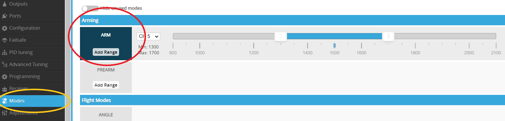
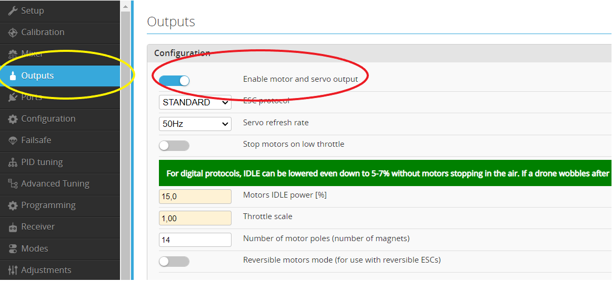

You can find all other details about INAV on YouTube and INAV documents. It is impossible to give all the information about INAV on this page and this is not my main purpose.
### Basic Setup
Click on the images to enlarge them.

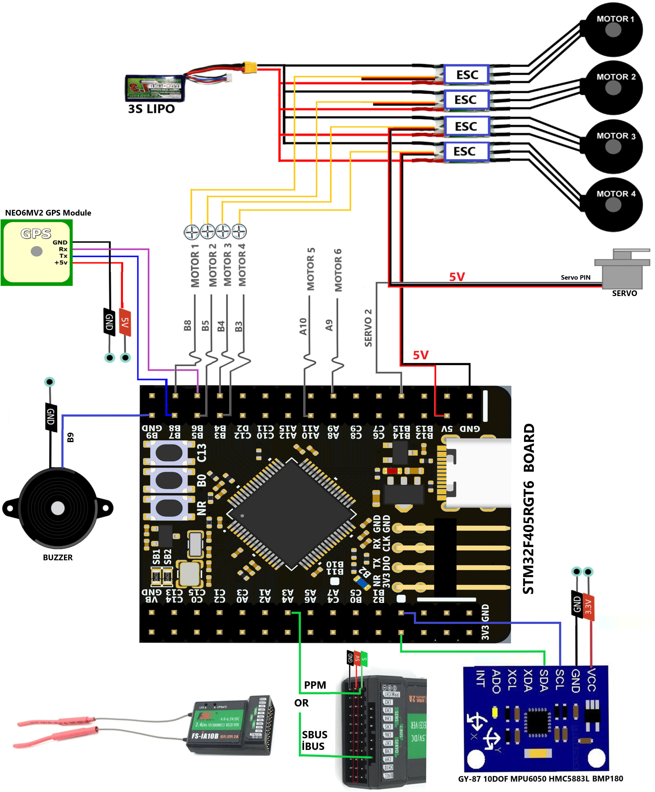

**MPU6050** Module is very slow. That's why the Microcontroller load goes up to **90%**. To avoid this, execute the following **CLI** command. 

**set looptime = 1500**

For performance, you can use the MPU6500 module with SPI2.
### PIN connections and details are as follows.
Click on the images to enlarge them.
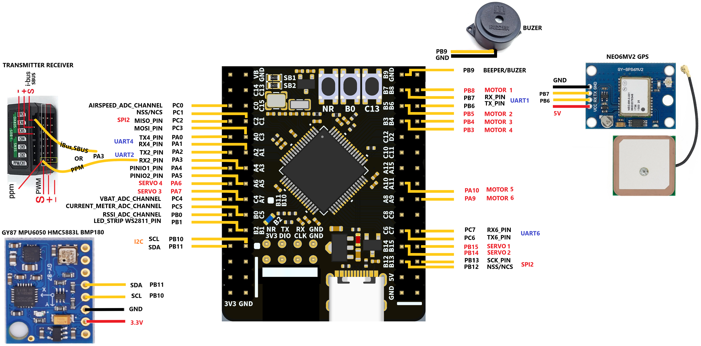

## Supported sensors.

### EXAMPLE SPI2 SENSOR CONNECTION
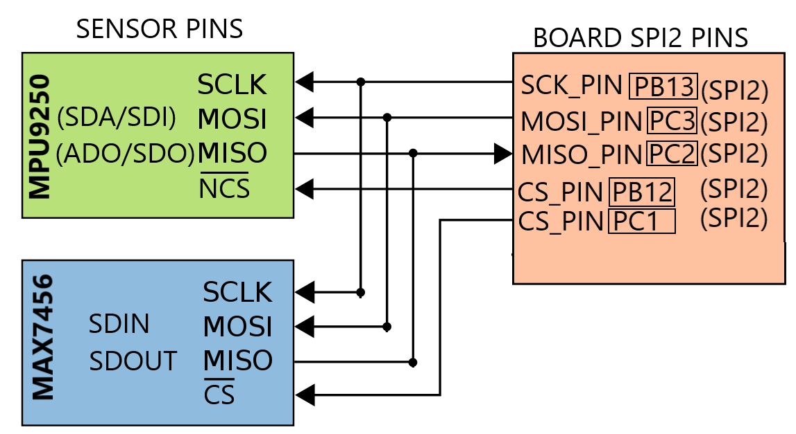

Some of the sensors use the I2C bus. Some also use **SPI2** connection. You can connect one sensor for each of the **Gyro, Acc, Baro, Mag** sensors. For example, when you connect an **MPU6500**, you cannot use the **MPU6050**. The same is true for the **MPU9250**.
The following sensors use **SPI2** connection.

1. MPU6500
2. BMI160
3. BMI270
4. MPU9250
5. ICM42605

You can use one of these sensors.

### I2C SENSOR CONNECTION
You can also use I2C with multiple sensors as follows. You can use only one of the similar sensors in **I2C**.
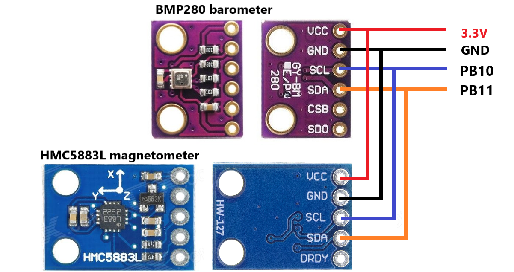

## Supported Internal MicroSD Card.
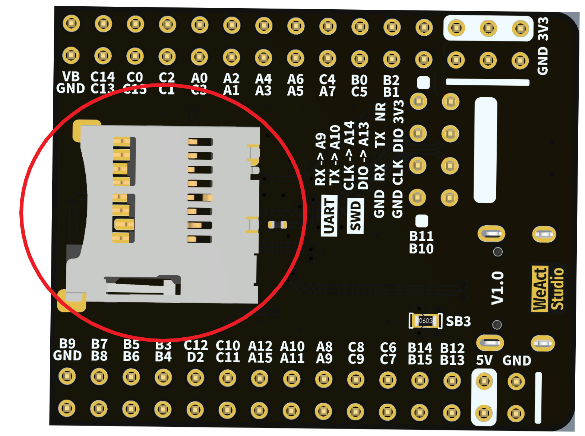

## Supported Extranal OSD.
You can add OSD support using the MAX7456 chip by connecting it to the **SPI2** pins.
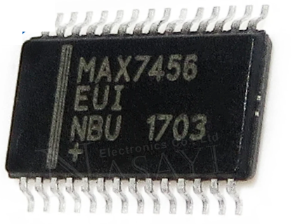
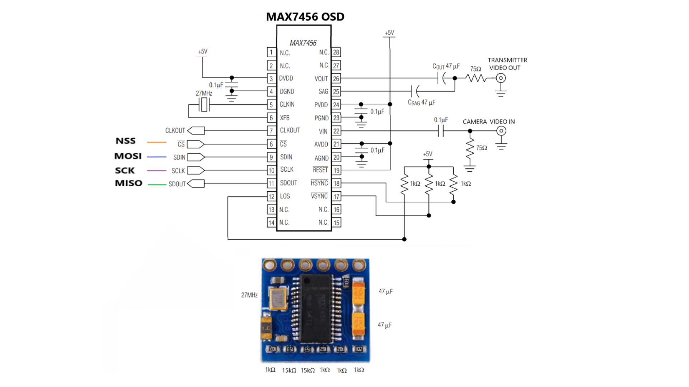

## RECEIVER Connection
You can connect the receiver of your transmitter to the **UART2** pin input as follows. You can use one of these receivers. For **SBUS** support, you need to use an inverter consisting of one transistor and two resistors.
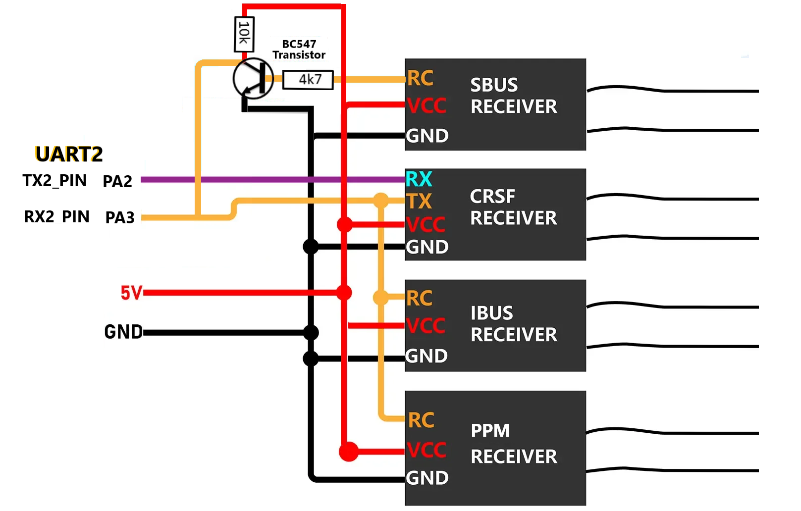
Sbus receiver/Ibus receiver/PPM receiver please enable Serial RX for UART2
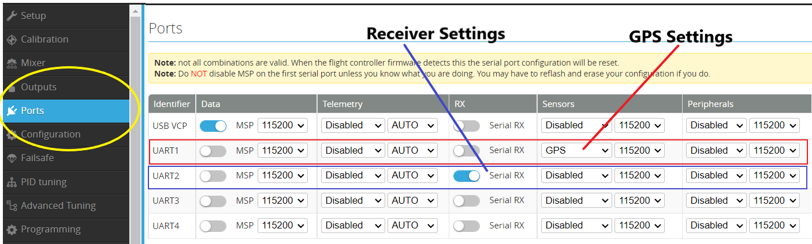
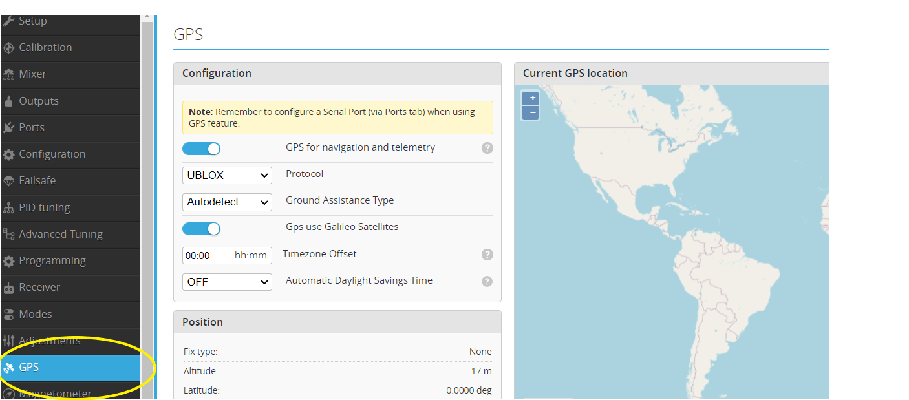

## ESC and Motor connection

## ESC and SERVO connection
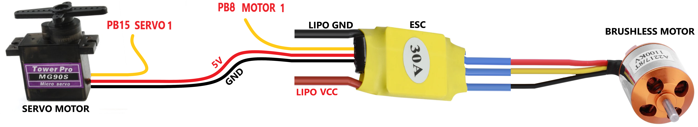
## Motor, ESC and LIPO battery connection
The image below is an example of motor and LIPO battery connections. You need to connect the motor sequence according to the order shown in the "**INAV Configurator**" settings.

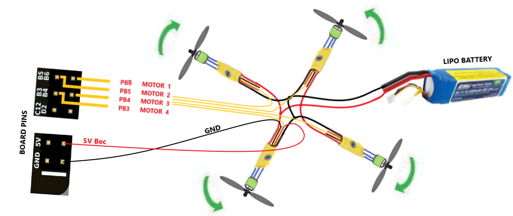

## Battery Monitor
To monitor the status of your LIPO Battery, you need to calculate the voltage divider according to the information given below and the battery power and connect it to the **VBAT_ADC_CHANNEL PC4 Pin**.
You should calculate the value that will enter a maximum of **3.3** volts on the **PC4 pin**. More than **5V** will damage the Board.
(Voltage Divider Calculator site:) https://ohmslawcalculator.com/voltage-divider-calculator
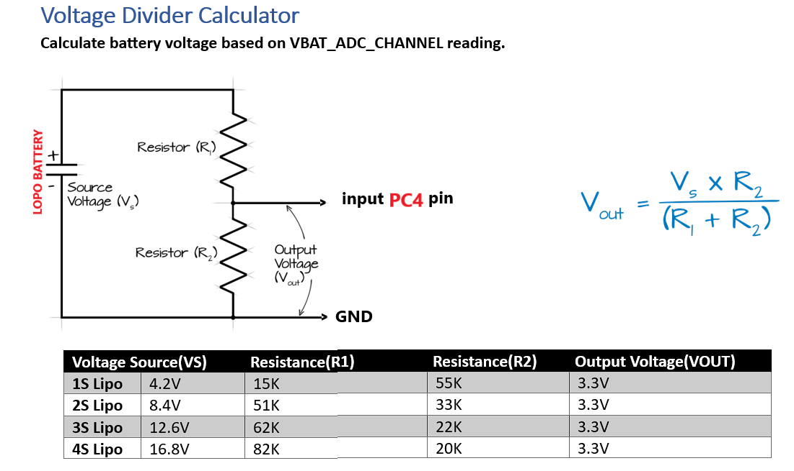

## WS2811 5 Volt Led Strip
There must be a **5V** external voltage source. Don't buy from board source, you will burn the microcontroller.
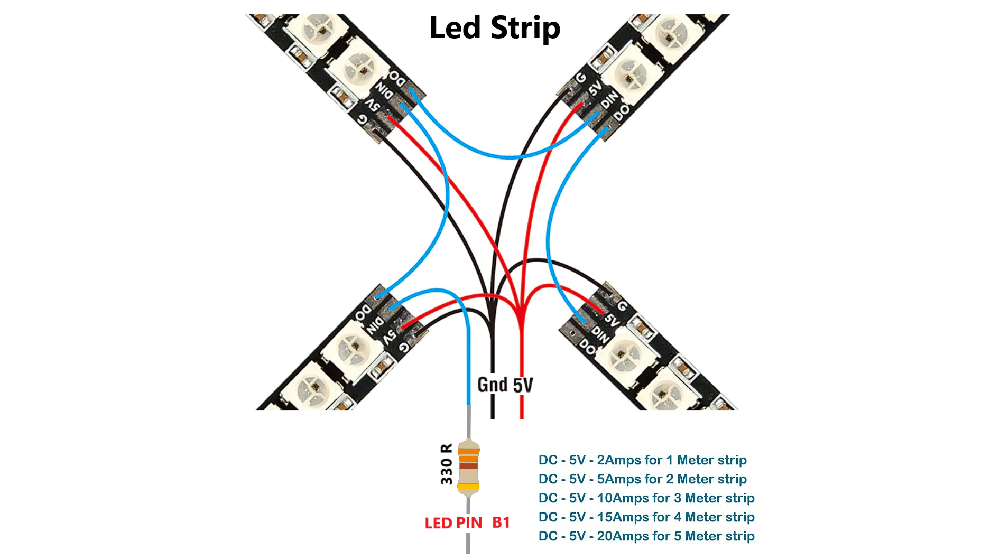
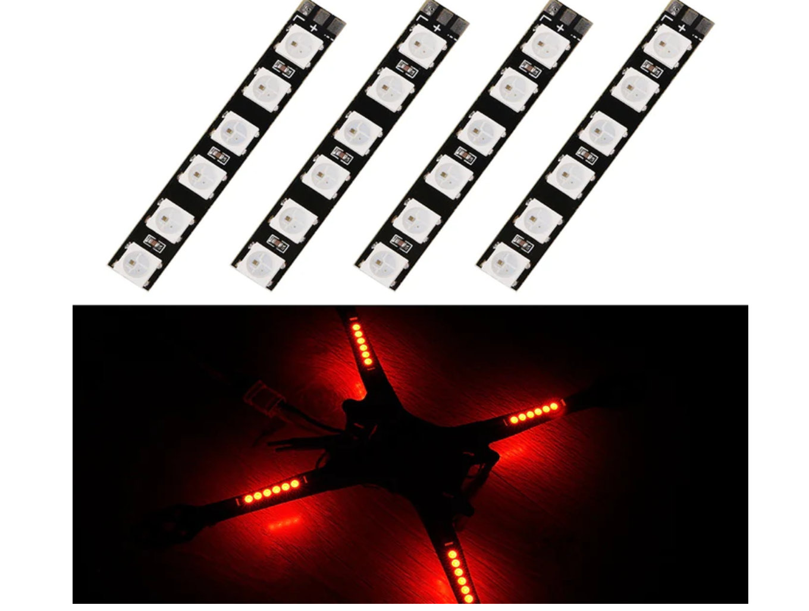

## Calibration for ESC
Instructions for setting throttle calibration for ESC high and low signal input:
1. Connect the ESC with the motor, connect the signal lead to the board according to the pin and motor port according to the diagram. You should do this for all of the motors you are going to use.
2. Open the INAV Configurator and connect to the flight control hub.
3. Adjust the gyroscope / accelerometer and magnometer calibration settings.
4. Turn on the remote control and enable the receiver protocol in the Receiver section. 
5. Go to the Output field and set the ESC output protocol according to you. We describe the setup for the STANDARD protocol.
6.To calibrate ESCs, make sure the propellers are off, flick on the “I understand” toggle, raise Master to full value, and plug in your battery.
7. The ESCs will go through their tones.
8. When the double beeping sound is heard (the highest point of the throttle is confirmed), move the throttle to the lowest point.
9. ESC calibration is considered done when three beeps mean OK.
10. Now unplug, plug in again, and raise Master very slowly until the motors are spinning comfortably.

This video your can help. https://www.youtube.com/watch?v=1IrgbY0YhqM

